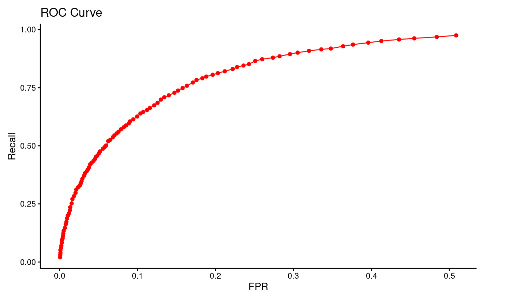
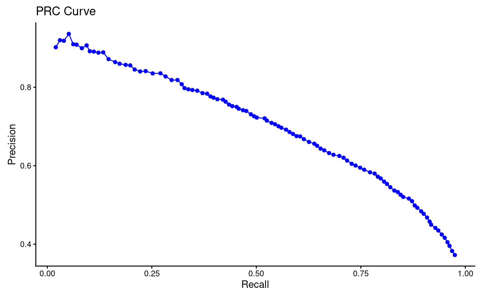

# m6APrediction

## Overview
m6APrediction is an R package designed to predict m6A methylation sites using a Random Forest model.  

The package provides:
- Functions to encode DNA sequences into machine-learning–ready numerical features  
- Functions to predict m6A status for a single sequence or multiple sequences  
- Example dataset and pre-trained Random Forest model included in the package  
- Easy installation through GitHub  

---

## Installation

### Before installation, ensure that the dependency package is installed
```r
install.packages("devtools")    # or: install.packages("remotes"). # or: install.packages("randomForest")
```
### Install m6APrediction from GitHub
```r
devtools::install_github("ZihanHe-xjtlu/m6APrediction")
library(m6APrediction)
```

---

## Load Example Data
```r
model <- readRDS(system.file("extdata", "rf_fit.rds", package = "m6APrediction"))
example_df <- read.csv(system.file("extdata", "m6A_input_example.csv",
                                   package = "m6APrediction"))
```

### Example Usage

#### Predict a Single Sequence
```r
library(m6APrediction)

 pred_single_result <- prediction_single(
     ml_fit = model,
     gc_content = 0.55,
     RNA_type = "mRNA",
     RNA_region = "CDS",
     exon_length = 1500,
     distance_to_junction = 120,
     evolutionary_conservation = 0.32,
     DNA_5mer = "ATCGA"
 )
print(pred_single_result)

```
#### Predict Multiple Sequences
```r
library(m6APrediction)

df <- read.csv(system.file("extdata", "m6A_input_example.csv",
                           package = "m6APrediction"))

results <- prediction_multiple(df)
head(results)
```

---

## Model Performance

Below are ROC and PRC curves generated in Practical 4.
These plots demonstrate the strong predictive performance of the Random Forest classifier.



---

## License

MIT License

